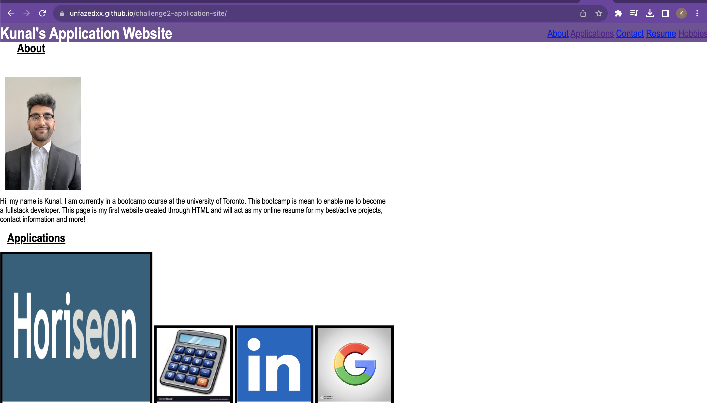

# challenge2-application-site

**Project Title --
Module 2 challenge: Application Website

**Description --
Create an Application website using html and css which satisfies the acceptance criteria provided. 

**Getting Started --
Code was generated from scratch, using online guides and Bootcamp notes/coursework

**Installing --
website can be viewed at: https://unfazedxx.github.io/challenge2-application-site/

**Author --
Kunal Shah NOVEMBER 2023

**Acknowledgments --
UTOR Bootcamp Module 2

